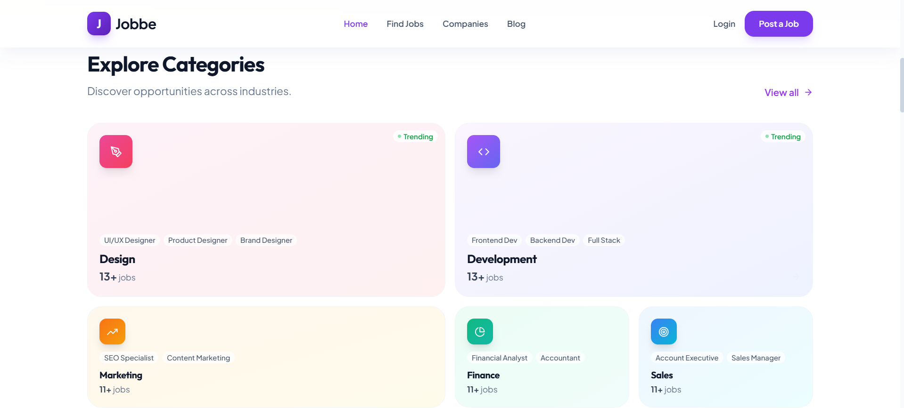

# 🚀 Job Portal System

### Modern Full-Stack Job Recruitment Platform

-blue?style=for-the-badge&logo=react>)  
  
  
  


---

## 📌 Overview

A fully functional **Full-Stack Job Portal Web Application** where:

- 👩‍💼 Job seekers can search and apply for jobs\
- 🏢 Employers can post and manage job listings\
- 🔐 Secure authentication ensures protected access\
- 📊 Role-based dashboards provide customized experiences

This project demonstrates real-world frontend-backend integration and
scalable architecture.

---

## ✨ Key Features

- 🔐 Secure User Authentication (JWT based)
- 🧑‍💼 Employer & Job Seeker Role Management
- 🔍 Job Search & Category Filtering
- 📄 Resume Upload & Profile Management
- 📊 Employer Dashboard for Job Management
- 🚀 Fully Deployed (Frontend + Backend)

---

# 📸 Application Screenshots

## 🏠 Home Page


## 📂 Categories Section



## 📋 Job Listings


## 🔐 Login Page


## 🏢 Employer Registration


## 📊 Employer Dashboard


---

# 🛠 Tech Stack

### Frontend

- React (Vite)
- Axios
- React Router
- CSS

### Backend

- Node.js
- Express.js
- MongoDB
- JWT Authentication

### Deployment

- Frontend: Vercel
- Backend: Render

---

## ⚙️ Installation & Setup

### 1️⃣ Clone Repository

```bash
git clone https://github.com/your-username/job-portal.git
cd job-portal
```

### 2️⃣ Backend Setup

```bash
cd backend
npm install
```

Create `.env` file:

```env
PORT=5000
MONGO_URI=your_mongodb_connection
JWT_SECRET=your_secret_key
```

Run backend:

```bash
npm start
```

### 3️⃣ Frontend Setup (Vite)

```bash
cd frontend
npm install
```

Create `.env` file:

```env
VITE_API_URL=https://your-backend-url.onrender.com
```

Run frontend:

```bash
npm run dev
```

---

## 🔐 Security Implementation

- 🔑 Password hashing using bcrypt
- 🔒 JWT-based authentication
- 🛡️ Protected API routes
- 🎭 Role-based authorization
- 🔐 Environment variable protection

---

## 🚀 Deployment

Layer Platform

---

Frontend Vercel
Backend Render
Database MongoDB Atlas

---

## 📈 Future Enhancements

- 📩 Email Notifications
- 💬 Real-Time Chat System
- 📊 Admin Dashboard
- 📌 Saved Jobs Feature
- 🤖 Resume Parsing Integration

---

# 👩‍💻 Author

**Saniya Musa Hakim**  
Frontend Developer | AI & Data Science Background

---

⭐ If you like this project, don't forget to star the repository!
